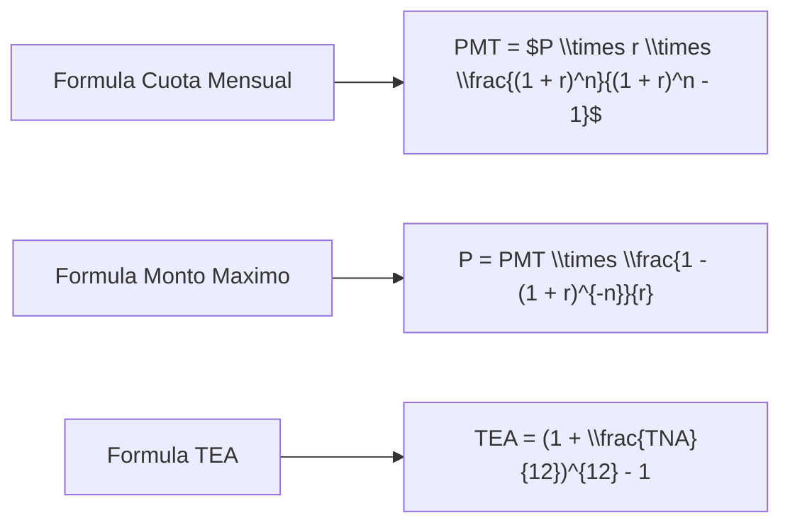

# Documentacion del Calculador de Prestamos UVA

Este repositorio contiene la documentacion detallada del Calculador de Prestamos UVA, una aplicacion React que permite a los usuarios simular prestamos hipotecarios en Unidades de Valor Adquisitivo (UVA) en Argentina.

## 📑 Contenido

La documentacion esta organizada en las siguientes secciones:

1. [Arquitectura del Sistema](./diagrams/architecture.md) - Diagramas que muestran la estructura general del sistema.
2. [Formulas Matematicas](./formulas/README.md) - Explicacion detallada de todas las formulas utilizadas en el calculo de prestamos.
3. [Flujo de Datos](./diagrams/data-flow.md) - Diagramas que ilustran como fluyen los datos en la aplicacion.
4. [Componentes UI](./diagrams/components.md) - Estructura de los componentes de la interfaz de usuario.
5. [Funciones Principales](./diagrams/functions.md) - Diagramas explicativos de las funciones clave del sistema.
6. [Validaciones](./diagrams/validations.md) - Logica de validacion de datos de entrada.

## 🔍 Vista Previa del Sistema

El Calculador de Prestamos UVA es una aplicacion web que permite a los usuarios:

- Simular prestamos hipotecarios con distintos plazos y montos
- Verificar la cuota mensual estimada
- Visualizar la evolucion del capital e intereses
- Comparar diferentes escenarios de prestamos
- Analizar la amortizacion del prestamo

## 🧮 Principales Formulas Utilizadas

Las formulas matematicas clave utilizadas en este sistema incluyen:

Para una explicacion completa de todas las formulas, consulte la [documentacion de formulas](./formulas/README.md).

## 🔄 Flujo Principal del Sistema

## 🛠️ Tecnologias Utilizadas

- React
- Next.js
- TypeScript
- shadcn/ui
- ApexCharts

## 📊 Visualizaciones Disponibles

El sistema ofrece varias visualizaciones para ayudar al usuario a entender mejor su prestamo:

1. Distribucion del ingreso mensual
2. Financiacion de la propiedad
3. Comparacion de montos maximos
4. Impacto del plazo en la cuota
5. Evolucion del saldo de capital
6. Composicion de las cuotas a lo largo del tiempo
7. Tabla de amortizacion
