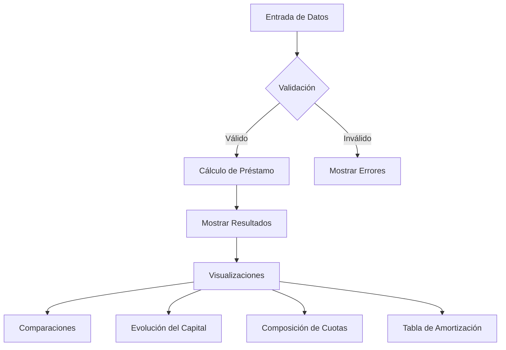

# Documentación del Calculador de Préstamos UVA

Este repositorio contiene la documentación detallada del Calculador de Préstamos UVA, una aplicación React que permite a los usuarios simular préstamos hipotecarios en Unidades de Valor Adquisitivo (UVA) en Argentina.

## 📑 Contenido

La documentación está organizada en las siguientes secciones:

1. [Arquitectura del Sistema](./diagrams/architecture.md) - Diagramas que muestran la estructura general del sistema.
2. [Fórmulas Matemáticas](./formulas/README.md) - Explicación detallada de todas las fórmulas utilizadas en el cálculo de préstamos.
3. [Flujo de Datos](./diagrams/data-flow.md) - Diagramas que ilustran cómo fluyen los datos en la aplicación.
4. [Componentes UI](./diagrams/components.md) - Estructura de los componentes de la interfaz de usuario.
5. [Funciones Principales](./diagrams/functions.md) - Diagramas explicativos de las funciones clave del sistema.
6. [Validaciones](./diagrams/validations.md) - Lógica de validación de datos de entrada.

## 🔍 Vista Previa del Sistema

El Calculador de Préstamos UVA es una aplicación web que permite a los usuarios:

- Simular préstamos hipotecarios con distintos plazos y montos
- Verificar la cuota mensual estimada
- Visualizar la evolución del capital e intereses
- Comparar diferentes escenarios de préstamos
- Analizar la amortización del préstamo

## 🧮 Principales Fórmulas Utilizadas

Las fórmulas matemáticas clave utilizadas en este sistema incluyen:

```mermaid
graph LR
    A[Fórmula Cuota Mensual] --> B[PMT = P * r * (1 + r)^n / ((1 + r)^n - 1)]
    C[Fórmula Monto Máximo] --> D[P = PMT * ((1 - (1 + r)^-n) / r)]
    E[Fórmula TEA] --> F[TEA = (1 + TNA/12)^12 - 1]
```

Para una explicación completa de todas las fórmulas, consulte la [documentación de fórmulas](./formulas/README.md).

## 🔄 Flujo Principal del Sistema



## 🛠️ Tecnologías Utilizadas

- React
- Next.js
- TypeScript
- shadcn/ui
- ApexCharts

## 📊 Visualizaciones Disponibles

El sistema ofrece varias visualizaciones para ayudar al usuario a entender mejor su préstamo:

1. Distribución del ingreso mensual
2. Financiación de la propiedad
3. Comparación de montos máximos
4. Impacto del plazo en la cuota
5. Evolución del saldo de capital
6. Composición de las cuotas a lo largo del tiempo
7. Tabla de amortización
