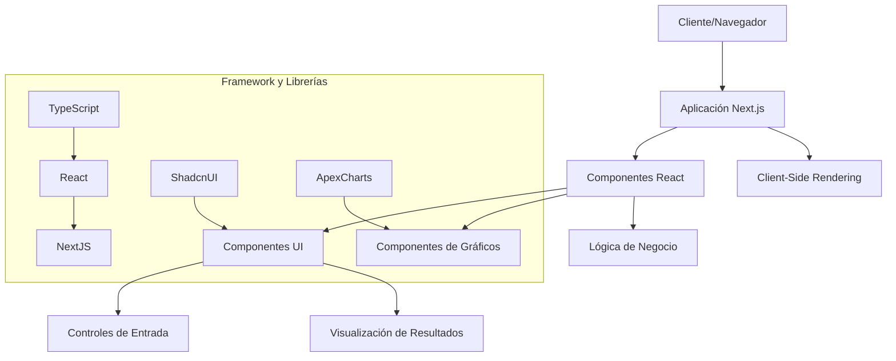
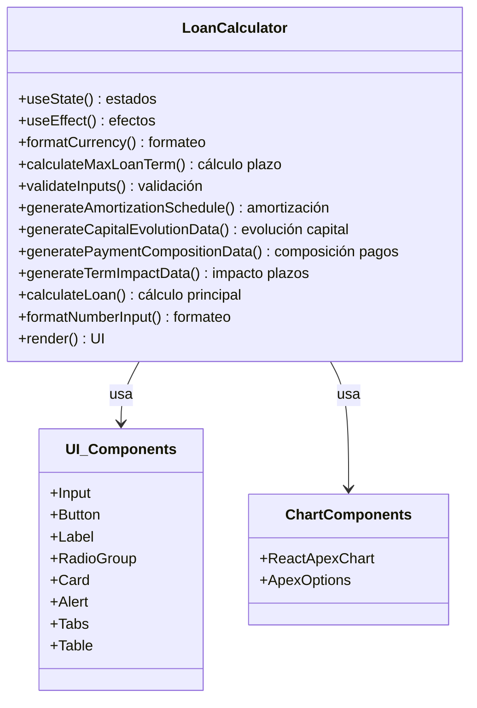
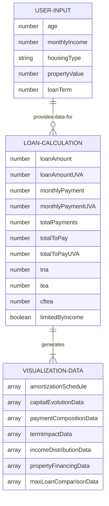
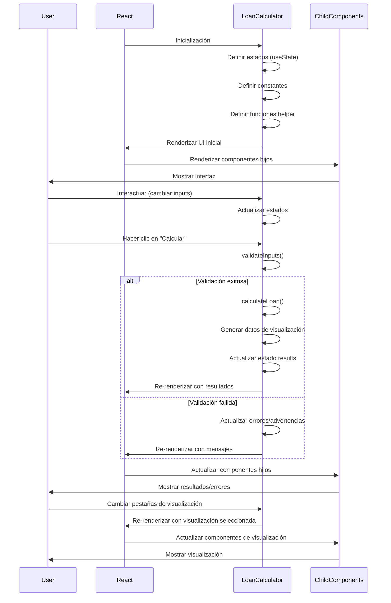
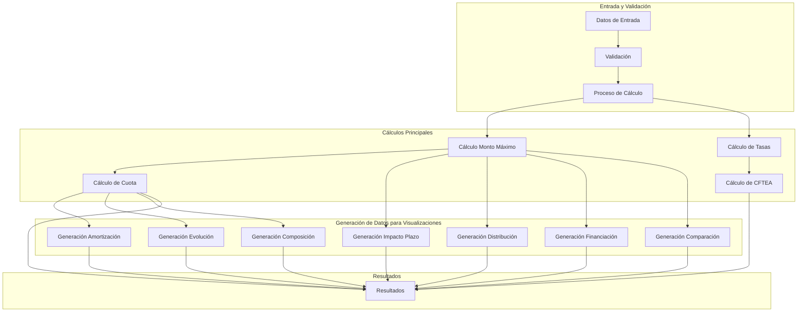
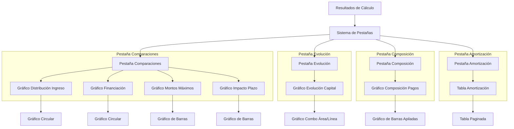
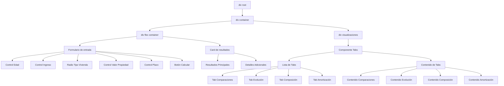
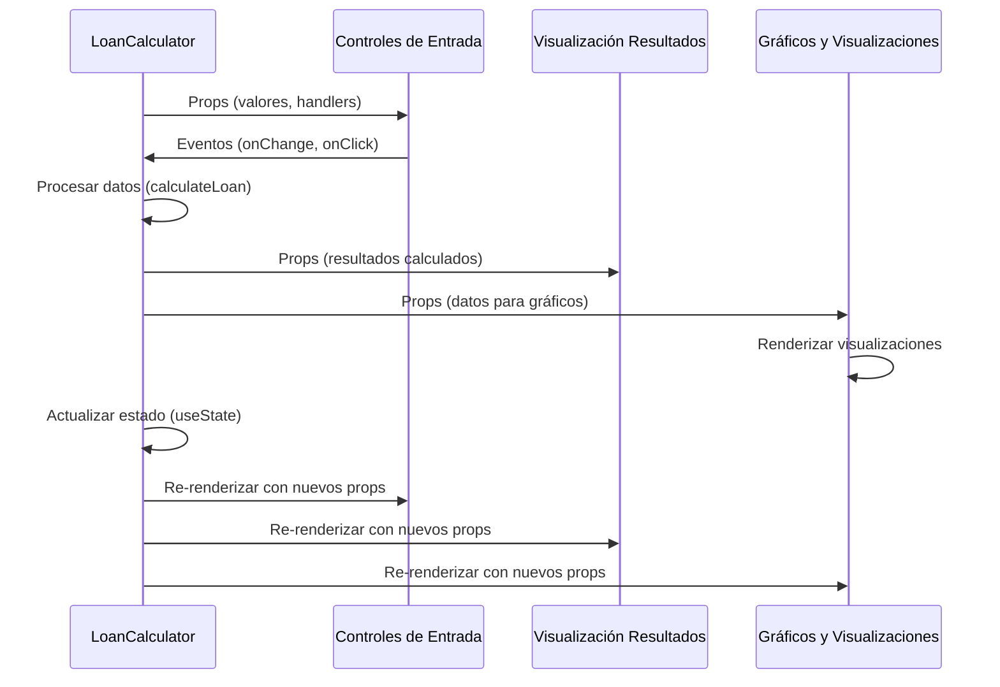

# Arquitectura del Calculador de Préstamos UVA

Este documento explica la arquitectura general del Calculador de Préstamos UVA, detallando sus componentes, interacciones y patrones de diseño.

## Arquitectura General

## Estructura de Componentes

El sistema sigue un patrón de diseño basado en componentes, con una clara separación entre la interfaz de usuario y la lógica del negocio:

## Arquitectura de Datos

La estructura de datos del sistema muestra cómo se organizan y relacionan los diferentes objetos de datos:

## Ciclo de Vida del Componente

Este diagrama ilustra el ciclo de vida del componente principal LoanCalculator:

## Arquitectura de Flujos de Cálculo

El siguiente diagrama muestra cómo se organizan los diferentes cálculos en el sistema:

## Arquitectura de Visualizaciones

Este diagrama muestra cómo se organizan las diferentes visualizaciones:

## Arquitectura de UI

Este diagrama ilustra la estructura jerárquica de los componentes de UI:

## Comunicación entre Componentes

