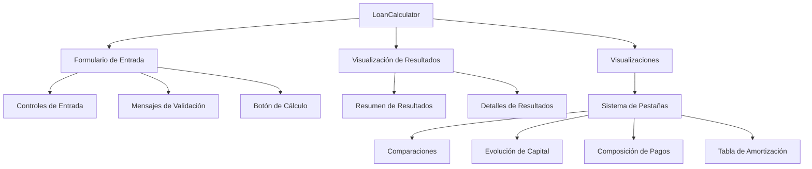
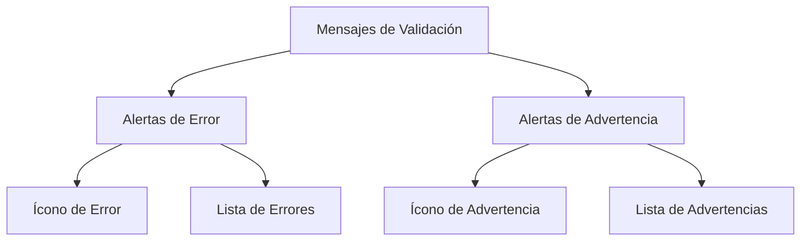
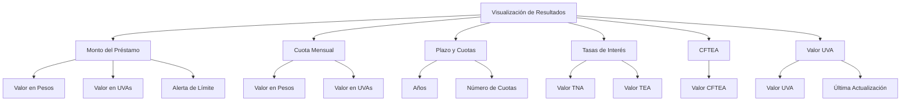
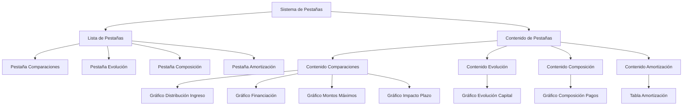
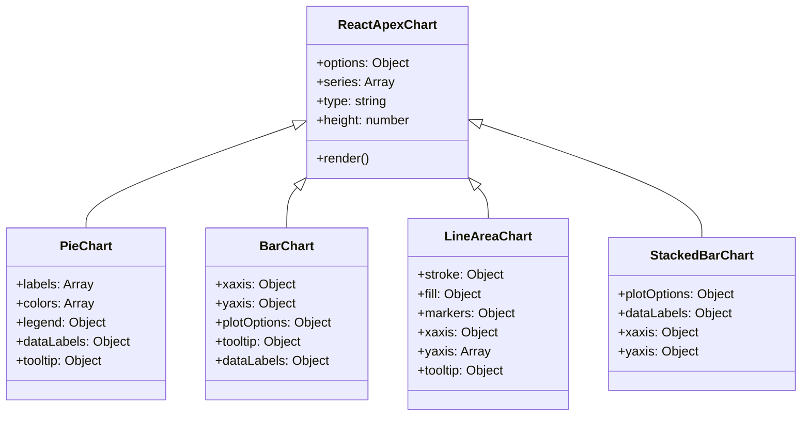
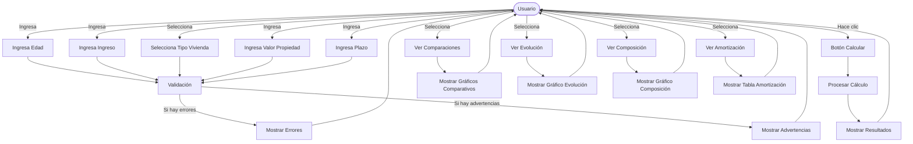
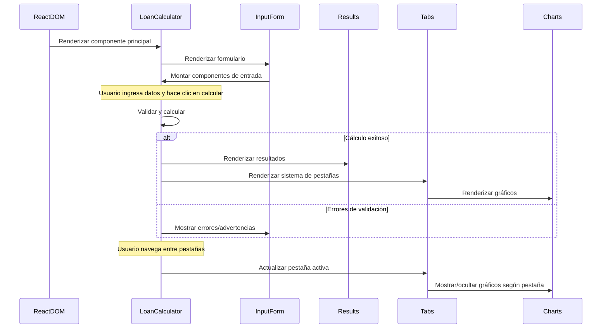
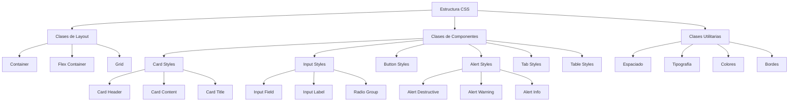

# Componentes UI del Calculador de Préstamos UVA

Este documento explica la estructura y organización de los componentes de interfaz de usuario utilizados en el Calculador de Préstamos UVA.

## Jerarquía de Componentes



## Controles de Entrada

Los controles de entrada permiten al usuario ingresar los datos necesarios para calcular el préstamo:

```mermaid
graph TD
    InputControls[Controles de Entrada] --> AgeInput[Control de Edad]
    InputControls --> IncomeInput[Control de Ingreso]
    InputControls --> HousingTypeRadio[Radio de Tipo de Vivienda]
    InputControls --> PropertyValueInput[Control de Valor de Propiedad]
    InputControls --> LoanTermInput[Control de Plazo]

    AgeInput --> AgeLabel[Label]
    AgeInput --> AgeInputField[Input Numérico]
    AgeInput --> AgeHelperText[Texto de Ayuda]

    IncomeInput --> IncomeLabel[Label]
    IncomeInput --> IncomeInputField[Input con Formato]
    IncomeInput --> IncomeHelperText[Texto de Ayuda]

    HousingTypeRadio --> HousingTypeLabel[Label]
    HousingTypeRadio --> PermanentOption[Opción Permanente]
    HousingTypeRadio --> NonPermanentOption[Opción No Permanente]

    PropertyValueInput --> PropertyValueLabel[Label]
    PropertyValueInput --> PropertyValueField[Input con Formato]
    PropertyValueInput --> PropertyValueHelperText[Texto de Ayuda]

    LoanTermInput --> LoanTermLabel[Label]
    LoanTermInput --> LoanTermField[Input Numérico]
    LoanTermInput --> LoanTermHelperText[Texto de Ayuda]
```



## Componentes de Validación

Los componentes de validación muestran mensajes de error y advertencia al usuario:



## Visualización de Resultados

La estructura de componentes para mostrar los resultados del cálculo:



## Sistema de Pestañas y Visualizaciones

Estructura de las pestañas y visualizaciones:



## Componentes de Gráficos

Detalle de los diferentes tipos de gráficos utilizados:



## Estructura de Tabla de Amortización

```mermaid
graph TD
    AmortizationTable[Tabla de Amortización] --> TableHeader[Encabezado de Tabla]
    AmortizationTable --> TableBody[Cuerpo de Tabla]

    TableHeader --> HeaderCuota[Cabecera "Cuota"]
    TableHeader --> HeaderMensual[Cabecera "Cuota Mensual"]
    TableHeader --> HeaderInteres[Cabecera "Interés"]
    TableHeader --> HeaderCapital[Cabecera "Capital"]
    TableHeader --> HeaderSaldo[Cabecera "Saldo Restante"]

    TableBody --> TableRows[Filas de Tabla]
    TableRows --> Row1[Fila 1]
    TableRows --> Row2[Fila 2]
    TableRows --> RowN[Fila N...]

    Row1 --> Cell1_1[Número Cuota]
    Row1 --> Cell1_2[Valor Cuota]
    Row1 --> Cell1_3[Interés Pagado]
    Row1 --> Cell1_4[Capital Amortizado]
    Row1 --> Cell1_5[Saldo Pendiente]
```

## Mapa de Interacción del Usuario

Este diagrama muestra las posibles interacciones del usuario con la interfaz:



## Flujo de Renderizado de Componentes



## Estructura de CSS/Clases


