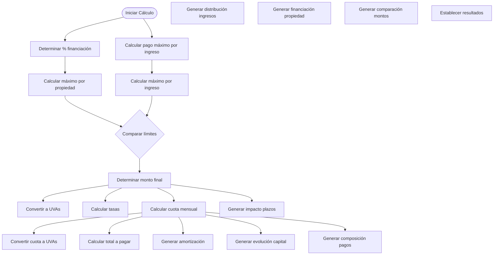

# Flujo de Datos del Calculador de Préstamos UVA

Este documento explica cómo fluyen los datos a través del sistema, desde la entrada del usuario hasta las visualizaciones finales.

## Diagrama General de Flujo de Datos

## Flujo de Estados

El componente `LoanCalculator` gestiona varios estados que evolucionan durante la interacción del usuario:

## Diagrama de Variables de Estado

El componente mantiene múltiples variables de estado que afectan los cálculos:

## Flujo de Validación de Datos

## Flujo Detallado de Cálculo

## Flujo de Generación de Gráficos

## Transformación Detallada de Datos

Este diagrama muestra cómo se transforman los datos desde la entrada hasta cada visualización:

## Flujo de Actualización de UI

