# Funciones Principales del Calculador de Préstamos UVA

Este documento explica en detalle las funciones principales utilizadas en el Calculador de Préstamos UVA, mostrando sus entradas, salidas y lógica interna.

## Mapa General de Funciones

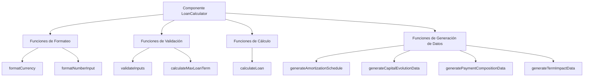

## Función: formatCurrency

Esta función convierte un número en una cadena formateada como moneda argentina.

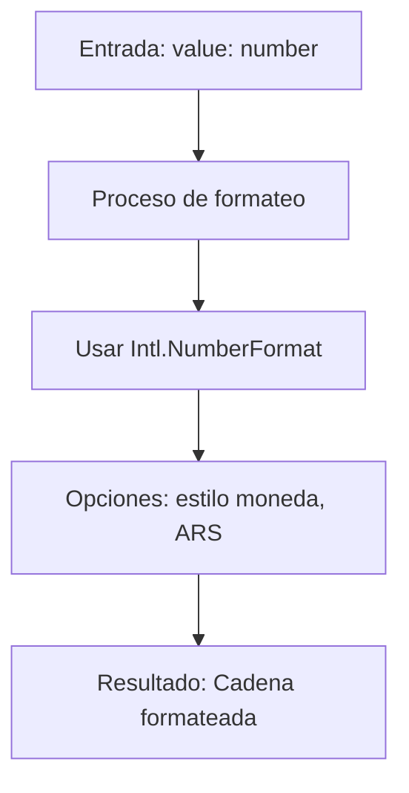

**Firma de la función:**
```javascript
const formatCurrency = (value: number) => {
  return new Intl.NumberFormat("es-AR", {
    style: "currency",
    currency: "ARS",
    maximumFractionDigits: 0,
  }).format(value)
}
```

## Función: calculateMaxLoanTerm

Calcula el plazo máximo de préstamo basado en la edad del solicitante.

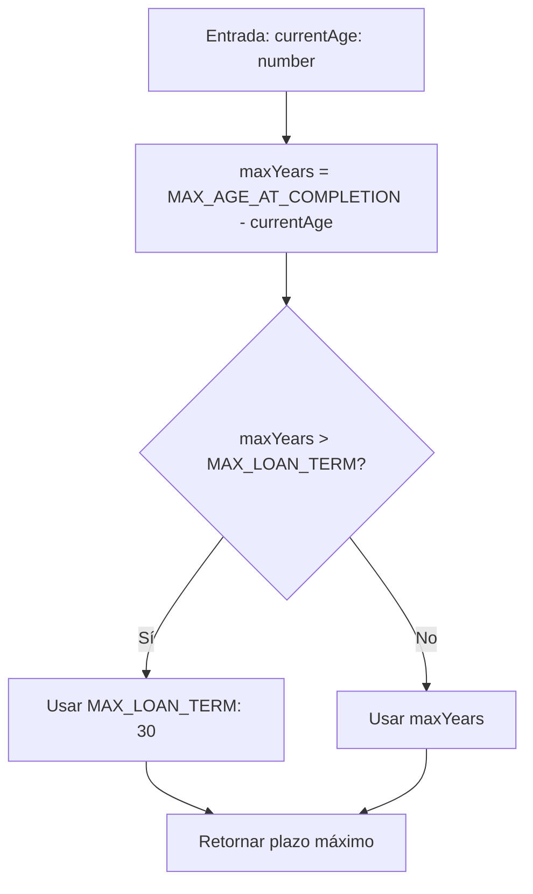

**Firma de la función:**
```javascript
const calculateMaxLoanTerm = (currentAge: number) => {
  const maxYears = MAX_AGE_AT_COMPLETION - currentAge
  return Math.min(maxYears, MAX_LOAN_TERM)
}
```

## Función: validateInputs

Valida todas las entradas del usuario y establece errores o advertencias según corresponda.

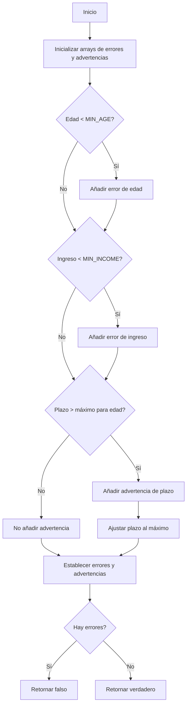

**Firma de la función:**
```javascript
const validateInputs = () => {
  const newErrors: string[] = []
  const newWarnings: string[] = []

  // Validate age
  if (age < MIN_AGE) {
    newErrors.push(`La edad mínima para solicitar un préstamo es de ${MIN_AGE} años.`)
  }

  // Validate income
  if (monthlyIncome < MIN_INCOME) {
    newErrors.push(`El ingreso mínimo requerido es de ${formatCurrency(MIN_INCOME)}.`)
  }

  // Validate loan term based on age
  const maxTerm = calculateMaxLoanTerm(age)
  if (loanTerm > maxTerm) {
    newWarnings.push(`Debido a tu edad (${age} años), el plazo máximo de préstamo es de ${maxTerm} años.`)
    setLoanTerm(maxTerm)
  }

  setErrors(newErrors)
  setWarnings(newWarnings)

  return newErrors.length === 0
}
```

## Función: calculateLoan

Función principal que realiza todos los cálculos del préstamo y genera todos los datos para visualizaciones.

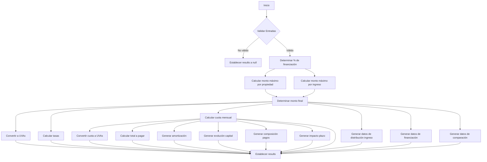

**Estructura simplificada de la función:**
```javascript
const calculateLoan = () => {
  if (!validateInputs()) {
    setResults(null)
    return
  }

  // Cálculos de monto máximo
  const financingPercentage = housingType === "permanent" ? 0.8 : 0.5
  const maxLoanByProperty = propertyValue * financingPercentage
  const maxMonthlyPayment = monthlyIncome * INCOME_RATIO
  const monthlyRate = INTEREST_RATE / 100 / 12
  const totalPayments = loanTerm * 12
  const maxLoanByIncome = maxMonthlyPayment * ((1 - Math.pow(1 + monthlyRate, -totalPayments)) / monthlyRate)
  const loanAmount = Math.min(maxLoanByProperty, maxLoanByIncome)

  // Conversiones y cálculos adicionales
  const loanAmountUVA = loanAmount / uvaValue
  const tna = INTEREST_RATE
  const tea = (Math.pow(1 + tna / 100 / 12, 12) - 1) * 100
  const cftea = tea + 0.19
  const monthlyPayment = (loanAmount * (monthlyRate * Math.pow(1 + monthlyRate, totalPayments))) /
    (Math.pow(1 + monthlyRate, totalPayments) - 1)
  const monthlyPaymentUVA = monthlyPayment / uvaValue
  const totalToPay = monthlyPayment * totalPayments
  const limitedByIncome = maxLoanByIncome < maxLoanByProperty

  // Generar datos para visualizaciones
  const amortizationSchedule = generateAmortizationSchedule(loanAmount, monthlyRate, totalPayments, monthlyPayment)
  const capitalEvolutionData = generateCapitalEvolutionData(loanAmount, monthlyRate, totalPayments, monthlyPayment)
  const paymentCompositionData = generatePaymentCompositionData(loanAmount, monthlyRate, totalPayments, monthlyPayment)
  const termImpactData = generateTermImpactData(loanAmount, monthlyRate)

  // Datos adicionales para gráficos
  const incomeDistributionData = [...]
  const propertyFinancingData = [...]
  const maxLoanComparisonData = [...]

  // Establecer resultados
  setResults({
    loanAmount,
    loanAmountUVA,
    totalPayments,
    monthlyPayment,
    // ...resto de propiedades
  })
}
```

## Función: generateAmortizationSchedule

Genera la tabla de amortización que muestra el desglose de cada cuota.

```mermaid
flowchart TD
    A[Entradas: monto, tasa, cuotas, pago] --> B[Inicializar array schedule]
    B --> C[Inicializar balance = loanAmount]
    C --> D{Para i de 1 a min(totalPayments, 12)}
    D --> E[Calcular interés: interest = balance * monthlyRate]
    E --> F[Calcular capital: principal = monthlyPayment - interest]
    F --> G[Actualizar balance: balance = balance - principal]
    G --> H[Agregar fila a schedule]
    H --> D
    D --> I[Retornar schedule]
```

**Firma de la función:**
```javascript
const generateAmortizationSchedule = (
  loanAmount: number,
  monthlyRate: number,
  totalPayments: number,
  monthlyPayment: number,
) => {
  const schedule = []
  let balance = loanAmount

  for (let i = 1; i <= Math.min(totalPayments, 12); i++) {
    const interest = balance * monthlyRate
    const principal = monthlyPayment - interest
    balance = balance - principal

    schedule.push({
      payment: i,
      monthlyPayment,
      interest,
      principal,
      balance: Math.max(0, balance),
    })
  }

  return schedule
}
```

## Función: generateCapitalEvolutionData

Genera datos para visualizar la evolución del saldo de capital a lo largo del préstamo.

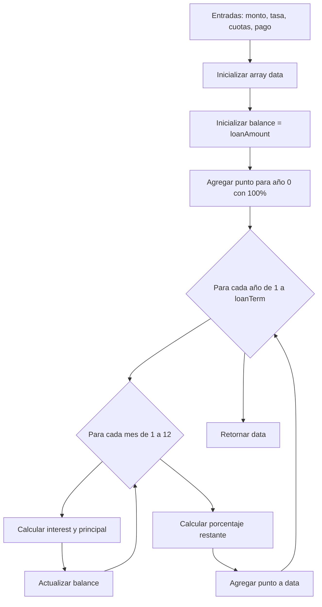

**Estructura simplificada de la función:**
```javascript
const generateCapitalEvolutionData = (
  loanAmount: number,
  monthlyRate: number,
  totalPayments: number,
  monthlyPayment: number,
) => {
  const data = []
  let balance = loanAmount

  // Para cada año
  for (let year = 0; year <= loanTerm; year++) {
    // Caso especial para año 0
    if (year === 0) {
      data.push({
        year,
        balance,
        percentage: 100,
      })
      continue
    }

    // Simular 12 meses
    for (let month = 1; month <= 12; month++) {
      const interest = balance * monthlyRate
      const principal = monthlyPayment - interest
      balance = Math.max(0, balance - principal)
    }

    // Agregar punto para el año actual
    data.push({
      year,
      balance,
      percentage: (balance / loanAmount) * 100,
    })
  }

  return data
}
```

## Función: generatePaymentCompositionData

Genera datos para visualizar cómo se distribuye cada pago entre interés y capital.

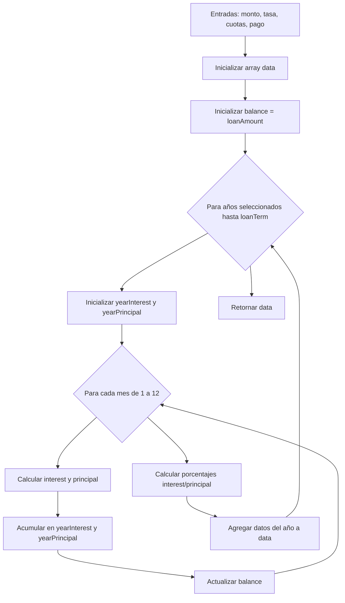

**Estructura simplificada de la función:**
```javascript
const generatePaymentCompositionData = (
  loanAmount: number,
  monthlyRate: number,
  totalPayments: number,
  monthlyPayment: number,
) => {
  const data = []
  let balance = loanAmount

  // Seleccionar años representativos
  for (let year = 1; year <= loanTerm; year += Math.max(1, Math.floor(loanTerm / 5))) {
    let yearInterest = 0
    let yearPrincipal = 0

    // Simular 12 meses
    for (let month = 1; month <= 12; month++) {
      const interest = balance * monthlyRate
      const principal = monthlyPayment - interest
      yearInterest += interest
      yearPrincipal += principal
      balance = Math.max(0, balance - principal)
    }

    // Calcular porcentajes y agregar datos
    data.push({
      year,
      interest: yearInterest,
      principal: yearPrincipal,
      interestPercentage: (yearInterest / (yearInterest + yearPrincipal)) * 100,
      principalPercentage: (yearPrincipal / (yearInterest + yearPrincipal)) * 100,
    })
  }

  return data
}
```

## Función: generateTermImpactData

Genera datos para visualizar cómo el plazo afecta a la cuota mensual y el costo total.

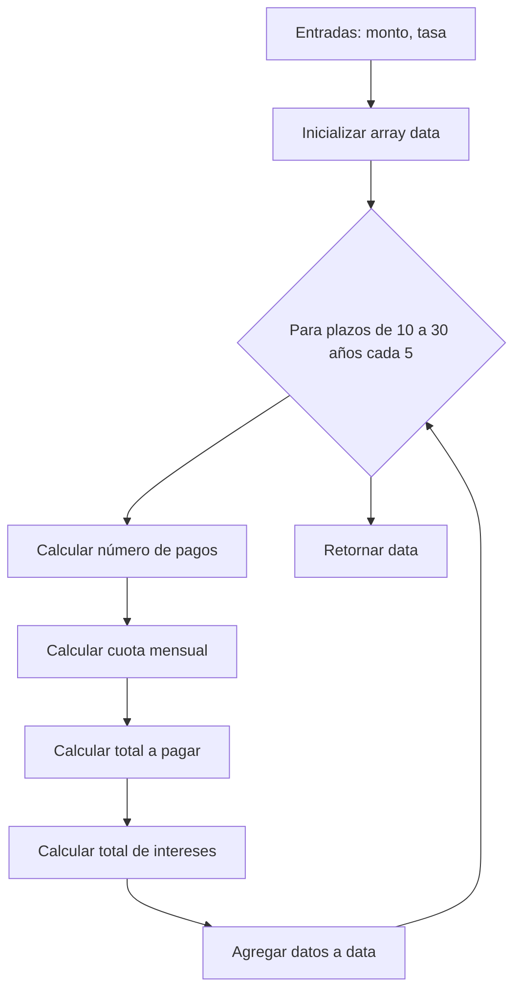

**Firma de la función:**
```javascript
const generateTermImpactData = (loanAmount: number, monthlyRate: number) => {
  const data = []

  // Calcular para diferentes plazos
  for (let term = 10; term <= 30; term += 5) {
    const payments = term * 12
    const payment = (loanAmount * (monthlyRate * Math.pow(1 + monthlyRate, payments))) /
                    (Math.pow(1 + monthlyRate, payments) - 1)

    data.push({
      term,
      payment,
      totalPaid: payment * payments,
      totalInterest: payment * payments - loanAmount,
    })
  }

  return data
}
```

## Diagrama de Secuencia de Llamadas a Funciones

Este diagrama muestra la secuencia de llamadas a funciones cuando un usuario hace clic en "Calcular":

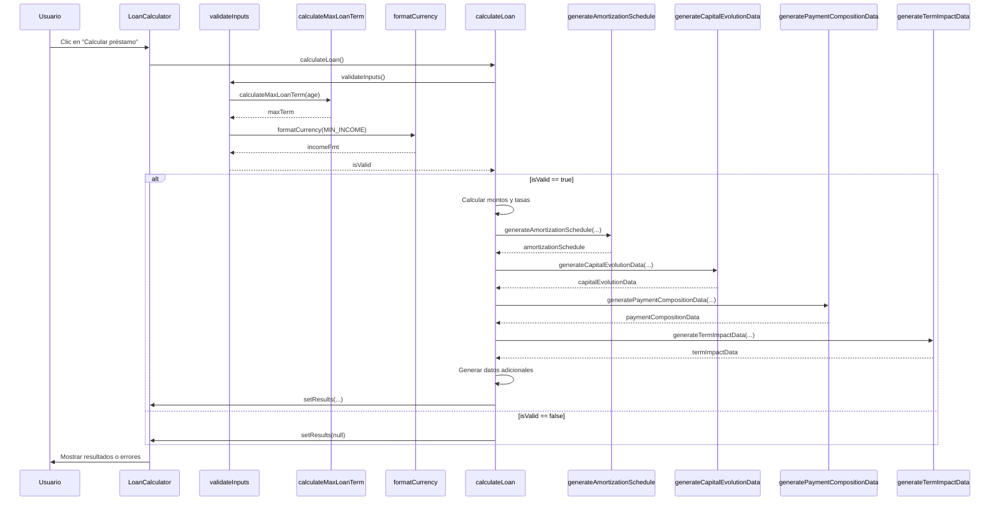

## Dependencias entre Funciones

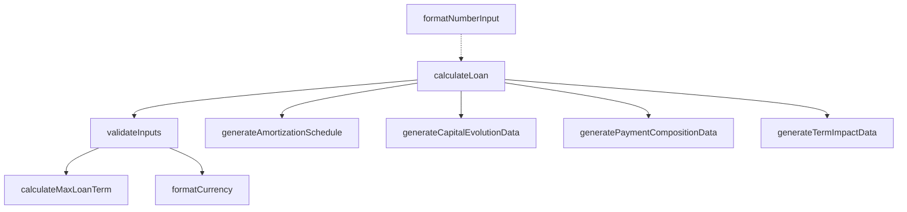

## Diagrama de Flujo de la Función formatNumberInput

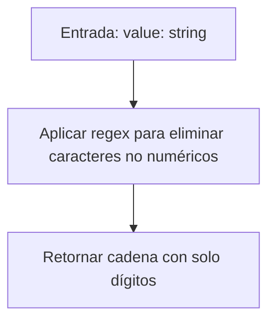

**Firma de la función:**
```javascript
const formatNumberInput = (value: string) => {
  // Remove non-numeric characters
  return value.replace(/\D/g, "")
}
```
