# Validaciones del Calculador de Prestamos UVA

Este documento detalla todas las validaciones implementadas en el Calculador de Prestamos UVA, explicando su proposito, logica y el impacto que tienen en la experiencia del usuario.

## Diagrama General de Validaciones

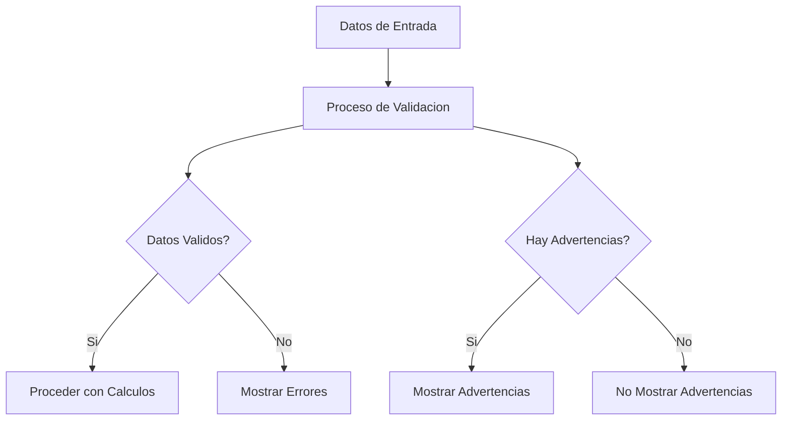

## Constantes y Umbrales de Validacion

El sistema utiliza las siguientes constantes para las validaciones:

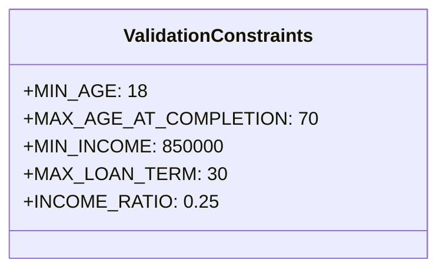

## Tipos de Validaciones

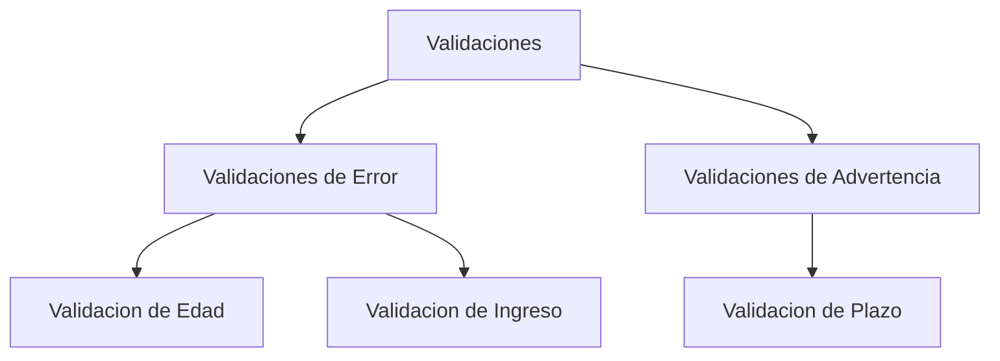

## Validacion de Edad

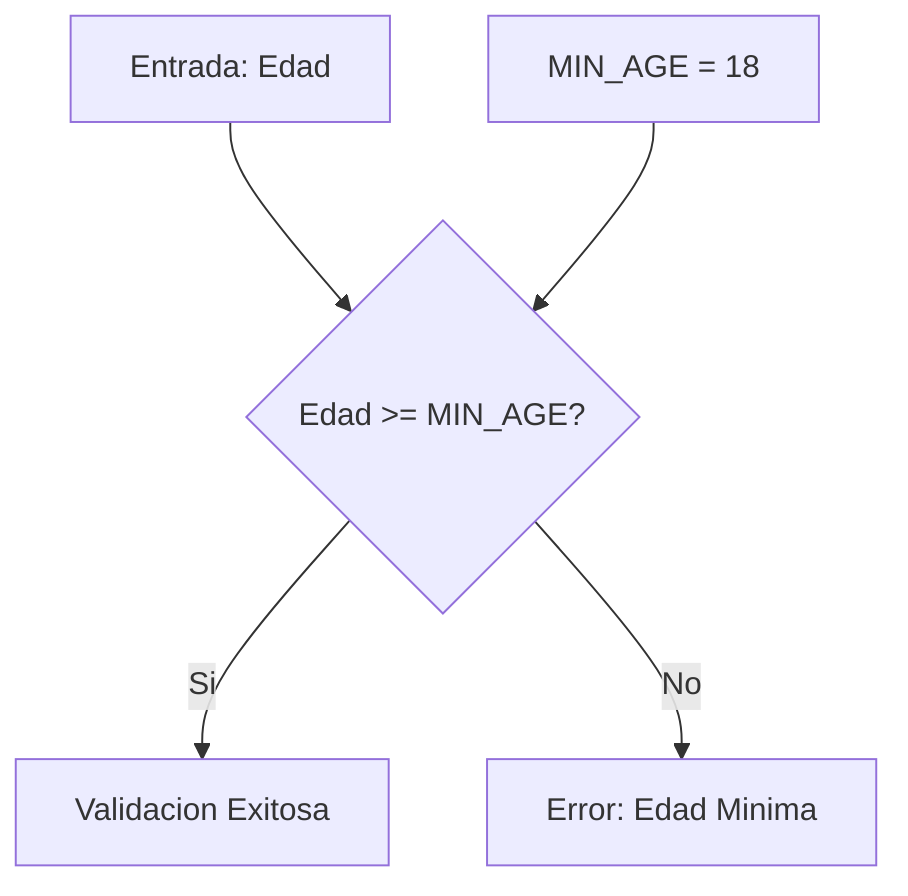

**Implementacion:**
```javascript
// Validate age
if (age < MIN_AGE) {
  newErrors.push(`La edad minima para solicitar un prestamo es de ${MIN_AGE} años.`)
}
```

## Validacion de Ingreso

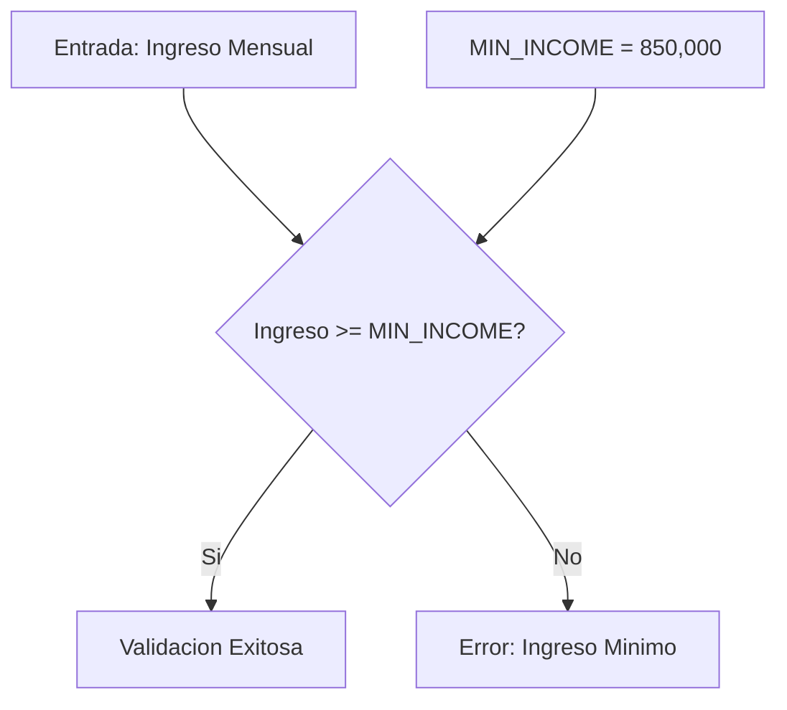

**Implementacion:**
```javascript
// Validate income
if (monthlyIncome < MIN_INCOME) {
  newErrors.push(`El ingreso minimo requerido es de ${formatCurrency(MIN_INCOME)}.`)
}
```

## Validacion de Plazo

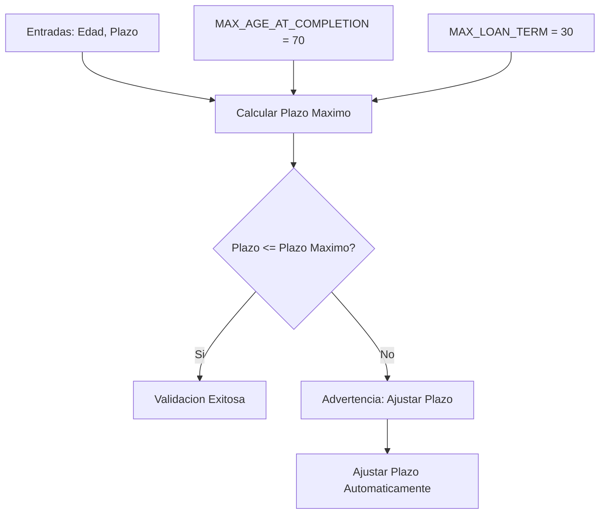

**Implementacion:**
```javascript
// Validate loan term based on age
const maxTerm = calculateMaxLoanTerm(age)
if (loanTerm > maxTerm) {
  newWarnings.push(`Debido a tu edad (${age} años), el plazo maximo de prestamo es de ${maxTerm} años.`)
  setLoanTerm(maxTerm)
}
```

## Funcion calculateMaxLoanTerm

```mermaid
flowchart TD
    A[Entrada: currentAge] --> B[maxYears = MAX_AGE_AT_COMPLETION - currentAge]
    B --> C[Retornar min(maxYears, MAX_LOAN_TERM)]
```

**Implementacion:**
```javascript
const calculateMaxLoanTerm = (currentAge) => {
  const maxYears = MAX_AGE_AT_COMPLETION - currentAge;
  return Math.min(maxYears, MAX_LOAN_TERM);
};
```

## Flujo de Validacion Completo

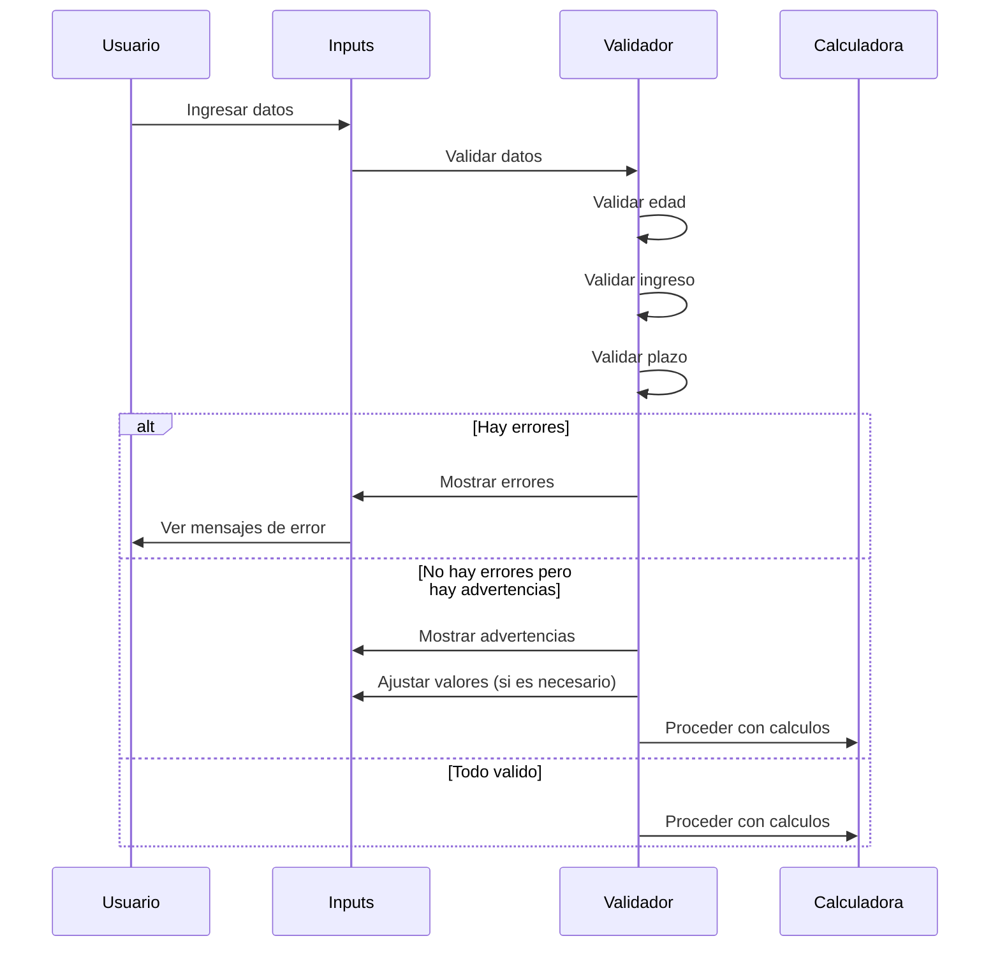

## Diagrama de Estados de Validacion

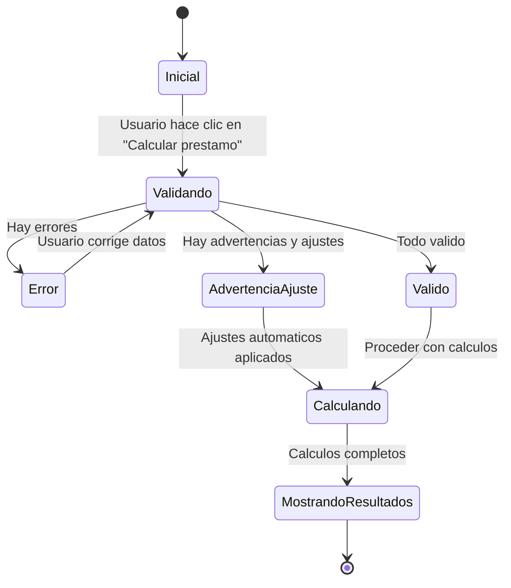

## Componentes UI de Validacion

Los mensajes de validacion se muestran a traves de componentes de alerta:

```mermaid
graph TD
    Validation[Validaciones] --> ErrorAlerts[Alertas de Error]
    Validation --> WarningAlerts[Alertas de Advertencia]

    ErrorAlerts --> DestructiveAlert[Alert variant="destructive"]
    DestructiveAlert --> ErrorIcon[AlertCircle Icon]
    DestructiveAlert --> ErrorMessages[Lista de Mensajes de Error]

    WarningAlerts --> YellowAlert[Alert className="border-yellow-500..."]
    YellowAlert --> InfoIcon[Info Icon]
    YellowAlert --> WarningMessages[Lista de Mensajes de Advertencia]
```

**Implementacion de UI de error:**
```jsx
{errors.length > 0 && (
  <Alert variant="destructive" className="mb-4">
    <AlertCircle className="h-4 w-4" />
    <AlertDescription>
      <ul className="list-disc pl-5 mt-2">
        {errors.map((error, index) => (
          <li key={index}>{error}</li>
        ))}
      </ul>
    </AlertDescription>
  </Alert>
)}
```

**Implementacion de UI de advertencia:**
```jsx
{warnings.length > 0 && (
  <Alert className="mb-4 border-yellow-500 text-yellow-800 bg-yellow-50">
    <Info className="h-4 w-4" />
    <AlertDescription>
      <ul className="list-disc pl-5 mt-2">
        {warnings.map((warning, index) => (
          <li key={index}>{warning}</li>
        ))}
      </ul>
    </AlertDescription>
  </Alert>
)}
```

## Restricciones en Inputs

Ademas de las validaciones explicitas, se aplican restricciones directamente en los controles de entrada:

```mermaid
graph TD
    InputRestrictions[Restricciones de Input] --> AgeInput[Input de Edad]
    InputRestrictions --> IncomeInput[Input de Ingreso]
    InputRestrictions --> LoanTermInput[Input de Plazo]

    AgeInput --> AgeMin[min={MIN_AGE}]
    AgeInput --> AgeMax[max={MAX_AGE_AT_COMPLETION}]

    IncomeInput --> IncomeFormat[Formateo a moneda]

    LoanTermInput --> LoanTermMin[min="1"]
    LoanTermInput --> LoanTermMax[max={calculateMaxLoanTerm(age)}]
```

**Implementacion de restricciones de edad:**
```jsx
<Input
  id="age"
  type="number"
  min={MIN_AGE}
  max={MAX_AGE_AT_COMPLETION}
  value={age}
  onChange={(e) => setAge(Number(e.target.value))}
  className="text-lg"
/>
```

**Implementacion de restricciones de plazo:**
```jsx
<Input
  id="loanTerm"
  type="number"
  min="1"
  max={calculateMaxLoanTerm(age)}
  value={loanTerm}
  onChange={(e) => setLoanTerm(Number(e.target.value))}
  className="text-lg"
/>
```

## Ajuste Automatico de Plazo

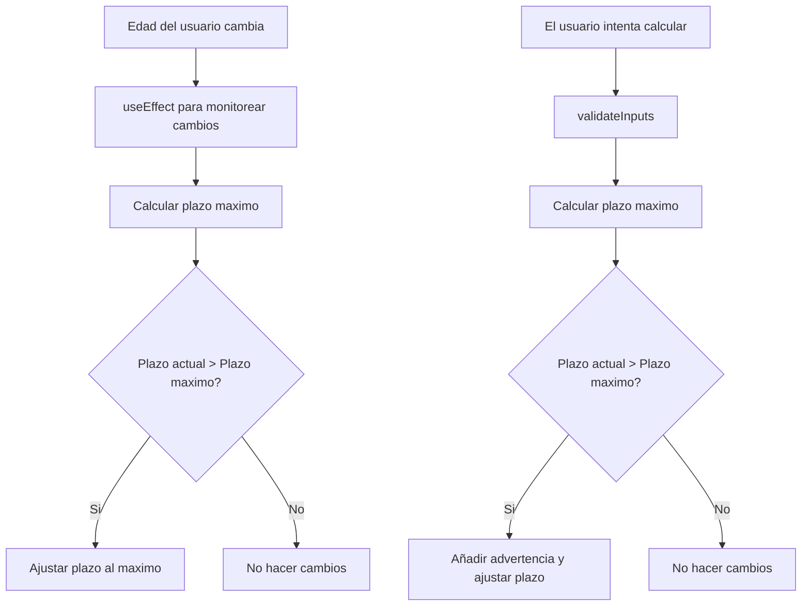

**Implementacion de ajuste automatico en useEffect:**
```javascript
// Update max loan term when age changes
useEffect(() => {
  const maxTerm = calculateMaxLoanTerm(age)
  if (loanTerm > maxTerm) {
    setLoanTerm(maxTerm)
  }
}, [age])
```

## Relacion entre Validaciones y Calculos

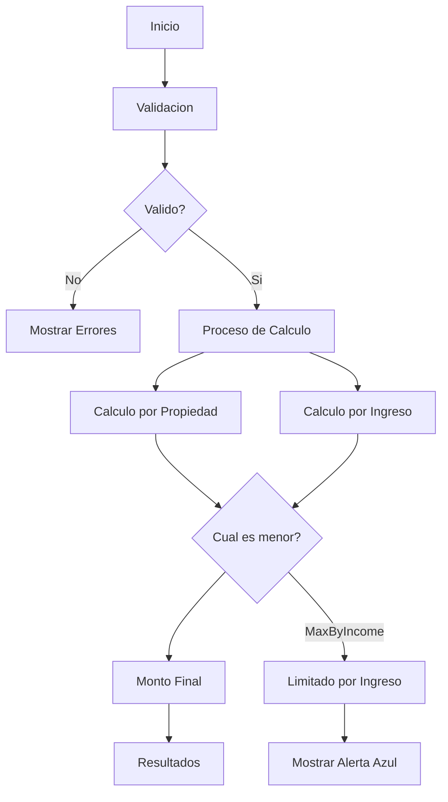

## Tooltip de Informacion Adicional

El sistema muestra informacion adicional para ayudar al usuario a entender las restricciones:

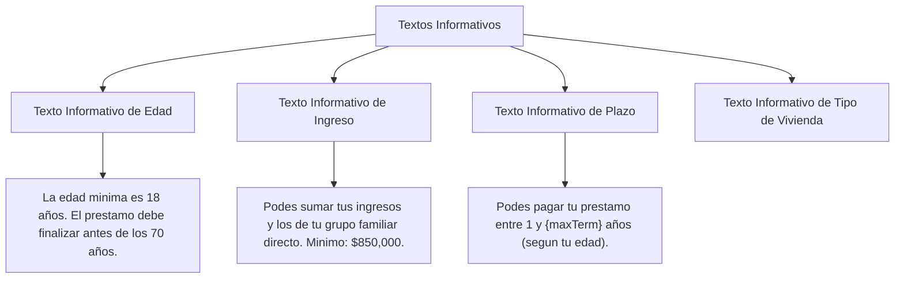

## Mensaje de Prestamo Limitado por Ingreso

Cuando el prestamo esta limitado por el ingreso, se muestra un mensaje informativo:

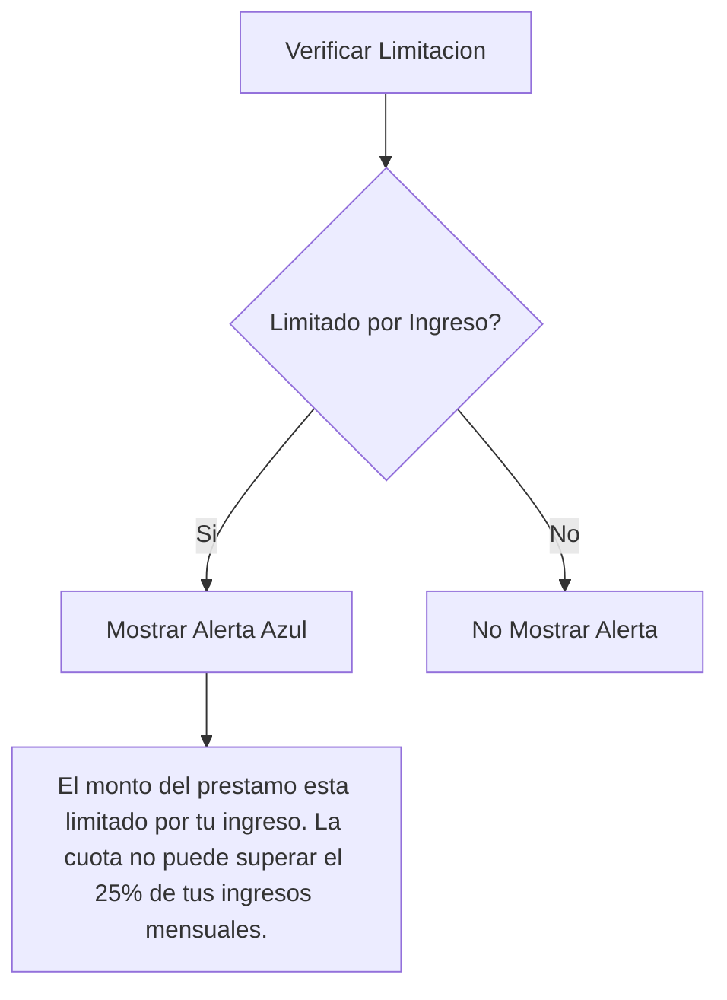

**Implementacion:**
```jsx
{results.limitedByIncome && (
  <Alert className="mt-3 border-blue-500 text-blue-800 bg-blue-50">
    <Info className="h-4 w-4" />
    <AlertDescription>
      El monto del prestamo esta limitado por tu ingreso. La cuota no puede superar el 25% de tus
      ingresos mensuales ({formatCurrency(results.maxMonthlyPayment)}).
    </AlertDescription>
  </Alert>
)}
```
