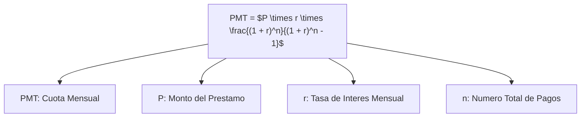
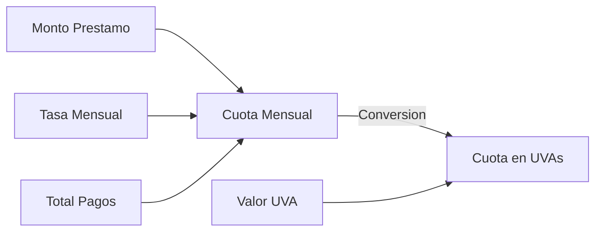
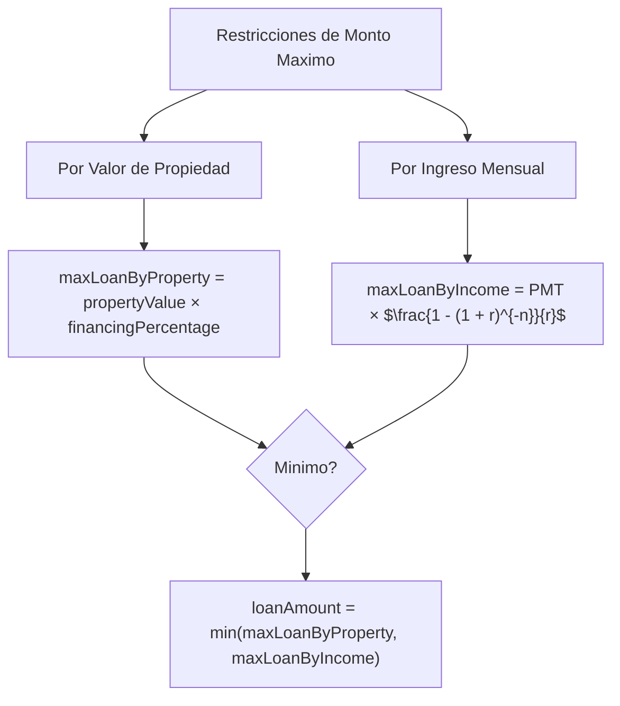
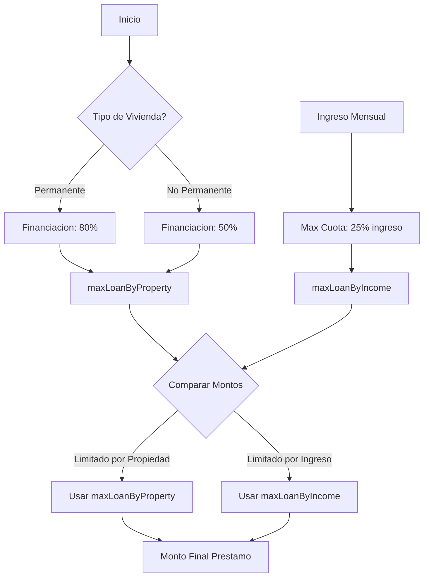
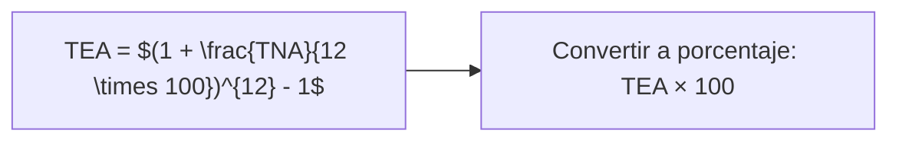
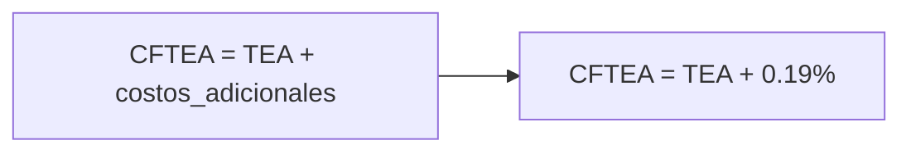
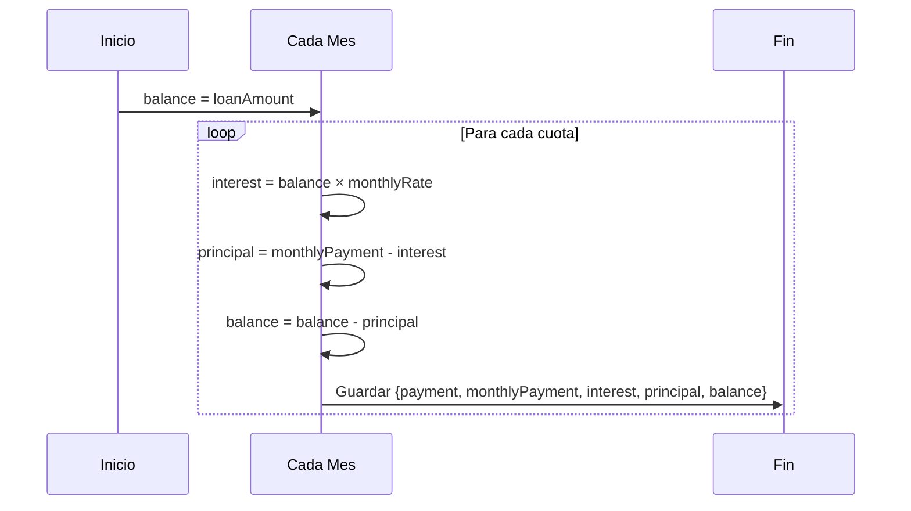
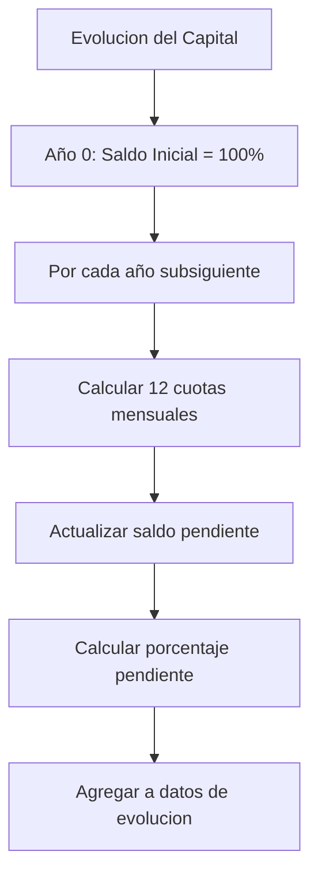
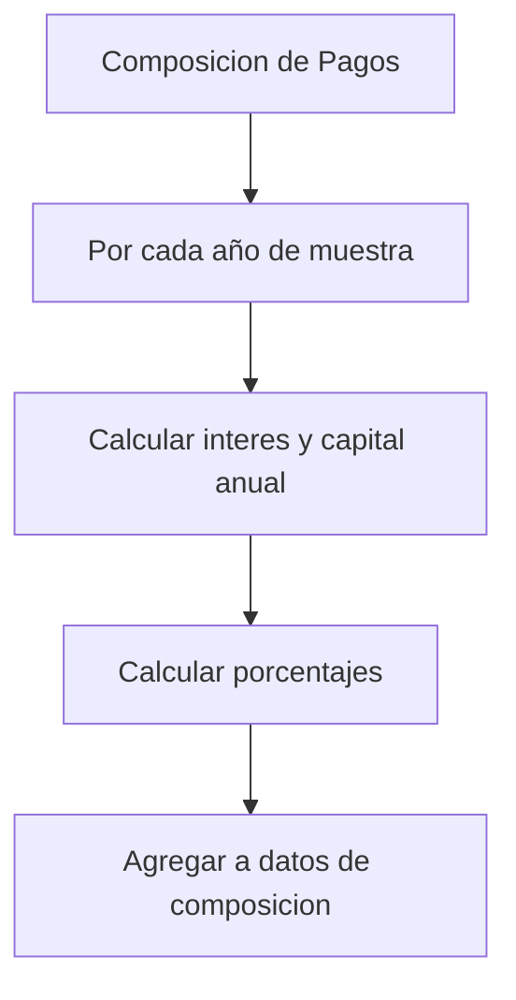
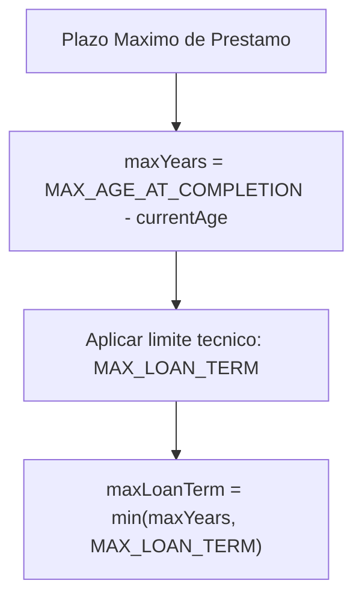

# Formulas Matematicas del Calculador de Prestamos UVA

Esta seccion documenta en detalle todas las formulas financieras utilizadas en el Calculador de Prestamos UVA. Cada formula esta explicada con su base matematica, significado de variables, y diagramas ilustrativos.

## Indice de Formulas

1. [Calculo de Cuota Mensual](#calculo-de-cuota-mensual)
2. [Calculo de Monto Maximo de Prestamo](#calculo-de-monto-maximo-de-prestamo)
3. [Calculo de Tasa Efectiva Anual (TEA)](#calculo-de-tasa-efectiva-anual-tea)
4. [Calculo de CFTEA](#calculo-de-cftea)
5. [Generacion de Amortizacion](#generacion-de-amortizacion)
6. [Evolucion del Capital](#evolucion-del-capital)
7. [Composicion de Pagos](#composicion-de-pagos)
8. [Calculo de Plazo Maximo](#calculo-de-plazo-maximo)

## Calculo de Cuota Mensual

La cuota mensual es calculada usando la formula estandar de amortizacion para prestamos de cuota fija:



**Variables:**
- **PMT** = Cuota mensual
- **P** = Monto del prestamo
- **r** = Tasa de interes mensual (TNA / 12 / 100)
- **n** = Numero total de pagos (años * 12)

**Implementacion en el codigo:**
```javascript
const monthlyPayment =
  (loanAmount * (monthlyRate * Math.pow(1 + monthlyRate, totalPayments))) /
  (Math.pow(1 + monthlyRate, totalPayments) - 1);
```

**Flujo de calculo:**



## Calculo de Monto Maximo de Prestamo

El monto maximo del prestamo se calcula en funcion de dos restricciones:

1. **Por valor de propiedad**: Un porcentaje del valor de la propiedad
2. **Por ingreso mensual**: El maximo que permite la cuota segun el ingreso



**Variables para monto por propiedad:**
- **maxLoanByProperty** = Monto maximo por valor de propiedad
- **propertyValue** = Valor de la propiedad
- **financingPercentage** = Porcentaje de financiacion (80% o 50%)

**Variables para monto por ingreso:**
- **maxLoanByIncome** = Monto maximo por ingreso
- **maxMonthlyPayment** = Pago mensual maximo (25% del ingreso)
- **r** = Tasa de interes mensual
- **n** = Numero total de pagos

**Implementacion en el codigo:**
```javascript
// Por valor de propiedad
const financingPercentage = housingType === "permanent" ? 0.8 : 0.5;
const maxLoanByProperty = propertyValue * financingPercentage;

// Por ingreso mensual
const maxMonthlyPayment = monthlyIncome * INCOME_RATIO;
const maxLoanByIncome = maxMonthlyPayment *
  ((1 - Math.pow(1 + monthlyRate, -totalPayments)) / monthlyRate);

// Monto final del prestamo
const loanAmount = Math.min(maxLoanByProperty, maxLoanByIncome);
```

**Diagrama de decision:**



## Calculo de Tasa Efectiva Anual (TEA)

La Tasa Efectiva Anual se calcula a partir de la Tasa Nominal Anual (TNA):



**Variables:**
- **TEA** = Tasa Efectiva Anual
- **TNA** = Tasa Nominal Anual (9.5% en el codigo)

**Implementacion en el codigo:**
```javascript
const tea = (Math.pow(1 + tna / 100 / 12, 12) - 1) * 100;
```

## Calculo de CFTEA

El Costo Financiero Total Efectivo Anual añade costos adicionales a la TEA:



**Variables:**
- **CFTEA** = Costo Financiero Total Efectivo Anual
- **TEA** = Tasa Efectiva Anual
- **Costos adicionales** = 0.19% en el codigo

**Implementacion en el codigo:**
```javascript
const cftea = tea + 0.19;
```

## Generacion de Amortizacion

La tabla de amortizacion muestra como se distribuye cada pago entre interes y capital:



**Variables:**
- **balance** = Saldo pendiente del prestamo
- **interest** = Interes de la cuota actual
- **principal** = Capital amortizado en la cuota actual
- **monthlyPayment** = Cuota mensual
- **monthlyRate** = Tasa de interes mensual

**Implementacion en el codigo:**
```javascript
const generateAmortizationSchedule = (
  loanAmount,
  monthlyRate,
  totalPayments,
  monthlyPayment,
) => {
  const schedule = [];
  let balance = loanAmount;

  for (let i = 1; i <= Math.min(totalPayments, 12); i++) {
    const interest = balance * monthlyRate;
    const principal = monthlyPayment - interest;
    balance = balance - principal;

    schedule.push({
      payment: i,
      monthlyPayment,
      interest,
      principal,
      balance: Math.max(0, balance),
    });
  }

  return schedule;
};
```

## Evolucion del Capital

Este calculo muestra como evoluciona el saldo pendiente a lo largo del prestamo:



**Variables:**
- **balance** = Saldo pendiente del prestamo
- **interest** = Interes de cada cuota
- **principal** = Capital amortizado en cada cuota
- **year** = Año actual del prestamo
- **percentage** = Porcentaje del prestamo pendiente

**Implementacion en el codigo:**
```javascript
const generateCapitalEvolutionData = (
  loanAmount,
  monthlyRate,
  totalPayments,
  monthlyPayment,
) => {
  const data = [];
  let balance = loanAmount;

  for (let year = 0; year <= loanTerm; year++) {
    if (year === 0) {
      data.push({
        year,
        balance,
        percentage: 100,
      });
      continue;
    }

    for (let month = 1; month <= 12; month++) {
      const interest = balance * monthlyRate;
      const principal = monthlyPayment - interest;
      balance = Math.max(0, balance - principal);
    }

    data.push({
      year,
      balance,
      percentage: (balance / loanAmount) * 100,
    });
  }

  return data;
};
```

**Diagrama de flujo:**


## Composicion de Pagos

Este calculo analiza como se distribuye cada cuota entre interes y capital a lo largo del tiempo:



**Variables:**
- **yearInterest** = Total de intereses pagados en el año
- **yearPrincipal** = Total de capital amortizado en el año
- **interestPercentage** = Porcentaje de la cuota anual destinado a intereses
- **principalPercentage** = Porcentaje de la cuota anual destinado a capital

**Implementacion en el codigo:**
```javascript
const generatePaymentCompositionData = (
  loanAmount,
  monthlyRate,
  totalPayments,
  monthlyPayment,
) => {
  const data = [];
  let balance = loanAmount;

  for (let year = 1; year <= loanTerm; year += Math.max(1, Math.floor(loanTerm / 5))) {
    let yearInterest = 0;
    let yearPrincipal = 0;

    for (let month = 1; month <= 12; month++) {
      const interest = balance * monthlyRate;
      const principal = monthlyPayment - interest;
      yearInterest += interest;
      yearPrincipal += principal;
      balance = Math.max(0, balance - principal);
    }

    data.push({
      year,
      interest: yearInterest,
      principal: yearPrincipal,
      interestPercentage: (yearInterest / (yearInterest + yearPrincipal)) * 100,
      principalPercentage: (yearPrincipal / (yearInterest + yearPrincipal)) * 100,
    });
  }

  return data;
};
```

**Diagrama de flujo:**


## Calculo de Plazo Maximo

El plazo maximo del prestamo se calcula en funcion de la edad del solicitante:



**Variables:**
- **maxYears** = Años maximos basados en la edad
- **MAX_AGE_AT_COMPLETION** = Edad maxima al finalizar el prestamo (70)
- **currentAge** = Edad actual del solicitante
- **MAX_LOAN_TERM** = Plazo maximo tecnico (30 años)

**Implementacion en el codigo:**
```javascript
const calculateMaxLoanTerm = (currentAge) => {
  const maxYears = MAX_AGE_AT_COMPLETION - currentAge;
  return Math.min(maxYears, MAX_LOAN_TERM);
};
```

## Interrelacion de Formulas

Las formulas estan interrelacionadas y se utilizan en conjunto para calcular el prestamo completo:


**Ejemplo de flujo completo:**


