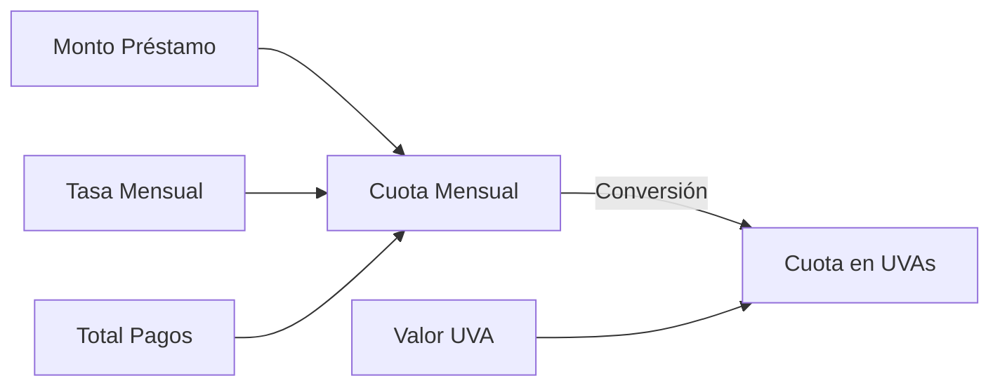
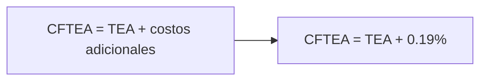
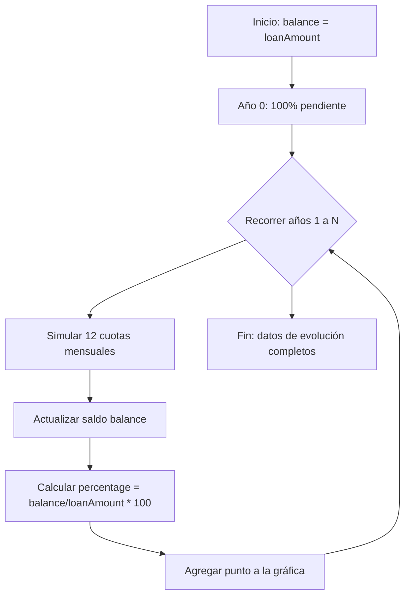
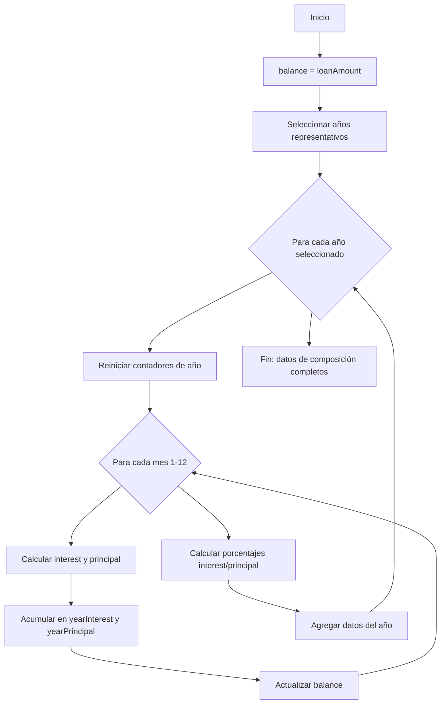
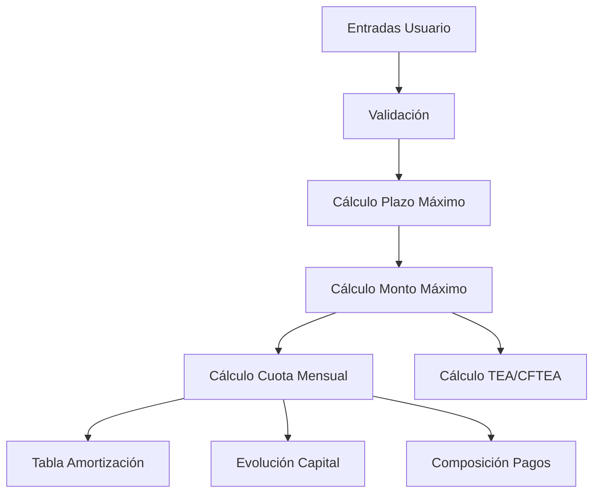
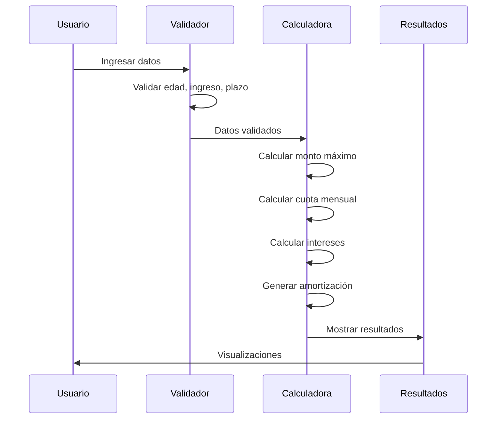

# Fórmulas Matemáticas del Calculador de Préstamos UVA

Esta sección documenta en detalle todas las fórmulas financieras utilizadas en el Calculador de Préstamos UVA. Cada fórmula está explicada con su base matemática, significado de variables, y diagramas ilustrativos.

## Índice de Fórmulas

1. [Cálculo de Cuota Mensual](#cálculo-de-cuota-mensual)
2. [Cálculo de Monto Máximo de Préstamo](#cálculo-de-monto-máximo-de-préstamo)
3. [Cálculo de Tasa Efectiva Anual (TEA)](#cálculo-de-tasa-efectiva-anual-tea)
4. [Cálculo de CFTEA](#cálculo-de-cftea)
5. [Generación de Amortización](#generación-de-amortización)
6. [Evolución del Capital](#evolución-del-capital)
7. [Composición de Pagos](#composición-de-pagos)
8. [Cálculo de Plazo Máximo](#cálculo-de-plazo-máximo)

## Cálculo de Cuota Mensual

La cuota mensual es calculada usando la fórmula estándar de amortización para préstamos de cuota fija:

```mermaid
graph TD
    A[PMT = P * r * (1 + r)^n / ((1 + r)^n - 1)] --> B[PMT: Cuota Mensual]
    A --> C[P: Monto del Préstamo]
    A --> D[r: Tasa de Interés Mensual]
    A --> E[n: Número Total de Pagos]
```

**Variables:**
- **PMT** = Cuota mensual
- **P** = Monto del préstamo
- **r** = Tasa de interés mensual (TNA / 12 / 100)
- **n** = Número total de pagos (años * 12)

**Implementación en el código:**
```javascript
const monthlyPayment =
  (loanAmount * (monthlyRate * Math.pow(1 + monthlyRate, totalPayments))) /
  (Math.pow(1 + monthlyRate, totalPayments) - 1);
```

**Flujo de cálculo:**



## Cálculo de Monto Máximo de Préstamo

El monto máximo del préstamo se calcula en función de dos restricciones:

1. **Por valor de propiedad**: Un porcentaje del valor de la propiedad
2. **Por ingreso mensual**: El máximo que permite la cuota según el ingreso

```mermaid
graph TD
    A[Restricciones de Monto Máximo] --> B[Por Valor de Propiedad]
    A --> C[Por Ingreso Mensual]
    B --> D[maxLoanByProperty = propertyValue * financingPercentage]
    C --> E[maxLoanByIncome = PMT * ((1 - (1 + r)^-n) / r)]
    D --> F{Mínimo?}
    E --> F
    F --> G[loanAmount = min(maxLoanByProperty, maxLoanByIncome)]
```

**Variables para monto por propiedad:**
- **maxLoanByProperty** = Monto máximo por valor de propiedad
- **propertyValue** = Valor de la propiedad
- **financingPercentage** = Porcentaje de financiación (80% o 50%)

**Variables para monto por ingreso:**
- **maxLoanByIncome** = Monto máximo por ingreso
- **maxMonthlyPayment** = Pago mensual máximo (25% del ingreso)
- **r** = Tasa de interés mensual
- **n** = Número total de pagos

**Implementación en el código:**
```javascript
// Por valor de propiedad
const financingPercentage = housingType === "permanent" ? 0.8 : 0.5;
const maxLoanByProperty = propertyValue * financingPercentage;

// Por ingreso mensual
const maxMonthlyPayment = monthlyIncome * INCOME_RATIO;
const maxLoanByIncome = maxMonthlyPayment *
  ((1 - Math.pow(1 + monthlyRate, -totalPayments)) / monthlyRate);

// Monto final del préstamo
const loanAmount = Math.min(maxLoanByProperty, maxLoanByIncome);
```

**Diagrama de decisión:**


## Cálculo de Tasa Efectiva Anual (TEA)

La Tasa Efectiva Anual se calcula a partir de la Tasa Nominal Anual (TNA):

```mermaid
graph LR
    A[TEA = (1 + TNA/12/100)^12 - 1] --> B[Convertir a porcentaje: TEA * 100]
```

**Variables:**
- **TEA** = Tasa Efectiva Anual
- **TNA** = Tasa Nominal Anual (9.5% en el código)

**Implementación en el código:**
```javascript
const tea = (Math.pow(1 + tna / 100 / 12, 12) - 1) * 100;
```

## Cálculo de CFTEA

El Costo Financiero Total Efectivo Anual añade costos adicionales a la TEA:



**Variables:**
- **CFTEA** = Costo Financiero Total Efectivo Anual
- **TEA** = Tasa Efectiva Anual
- **Costos adicionales** = 0.19% en el código

**Implementación en el código:**
```javascript
const cftea = tea + 0.19;
```

## Generación de Amortización

La tabla de amortización muestra cómo se distribuye cada pago entre interés y capital:


**Variables:**
- **balance** = Saldo pendiente del préstamo
- **interest** = Interés de la cuota actual
- **principal** = Capital amortizado en la cuota actual
- **monthlyPayment** = Cuota mensual
- **monthlyRate** = Tasa de interés mensual

**Implementación en el código:**
```javascript
const generateAmortizationSchedule = (
  loanAmount,
  monthlyRate,
  totalPayments,
  monthlyPayment,
) => {
  const schedule = [];
  let balance = loanAmount;

  for (let i = 1; i <= Math.min(totalPayments, 12); i++) {
    const interest = balance * monthlyRate;
    const principal = monthlyPayment - interest;
    balance = balance - principal;

    schedule.push({
      payment: i,
      monthlyPayment,
      interest,
      principal,
      balance: Math.max(0, balance),
    });
  }

  return schedule;
};
```

## Evolución del Capital

Este cálculo muestra cómo evoluciona el saldo pendiente a lo largo del préstamo:


**Variables:**
- **balance** = Saldo pendiente del préstamo
- **interest** = Interés de cada cuota
- **principal** = Capital amortizado en cada cuota
- **year** = Año actual del préstamo
- **percentage** = Porcentaje del préstamo pendiente

**Implementación en el código:**
```javascript
const generateCapitalEvolutionData = (
  loanAmount,
  monthlyRate,
  totalPayments,
  monthlyPayment,
) => {
  const data = [];
  let balance = loanAmount;

  for (let year = 0; year <= loanTerm; year++) {
    if (year === 0) {
      data.push({
        year,
        balance,
        percentage: 100,
      });
      continue;
    }

    for (let month = 1; month <= 12; month++) {
      const interest = balance * monthlyRate;
      const principal = monthlyPayment - interest;
      balance = Math.max(0, balance - principal);
    }

    data.push({
      year,
      balance,
      percentage: (balance / loanAmount) * 100,
    });
  }

  return data;
};
```

**Diagrama de flujo:**



## Composición de Pagos

Este cálculo analiza cómo se distribuye cada cuota entre interés y capital a lo largo del tiempo:


**Variables:**
- **yearInterest** = Total de intereses pagados en el año
- **yearPrincipal** = Total de capital amortizado en el año
- **interestPercentage** = Porcentaje de la cuota anual destinado a intereses
- **principalPercentage** = Porcentaje de la cuota anual destinado a capital

**Implementación en el código:**
```javascript
const generatePaymentCompositionData = (
  loanAmount,
  monthlyRate,
  totalPayments,
  monthlyPayment,
) => {
  const data = [];
  let balance = loanAmount;

  for (let year = 1; year <= loanTerm; year += Math.max(1, Math.floor(loanTerm / 5))) {
    let yearInterest = 0;
    let yearPrincipal = 0;

    for (let month = 1; month <= 12; month++) {
      const interest = balance * monthlyRate;
      const principal = monthlyPayment - interest;
      yearInterest += interest;
      yearPrincipal += principal;
      balance = Math.max(0, balance - principal);
    }

    data.push({
      year,
      interest: yearInterest,
      principal: yearPrincipal,
      interestPercentage: (yearInterest / (yearInterest + yearPrincipal)) * 100,
      principalPercentage: (yearPrincipal / (yearInterest + yearPrincipal)) * 100,
    });
  }

  return data;
};
```

**Diagrama de flujo:**



## Cálculo de Plazo Máximo

El plazo máximo del préstamo se calcula en función de la edad del solicitante:

```mermaid
graph TD
    A[Plazo Máximo de Préstamo] --> B[maxYears = MAX_AGE_AT_COMPLETION - currentAge]
    B --> C[Aplicar límite técnico: MAX_LOAN_TERM]
    C --> D[maxLoanTerm = min(maxYears, MAX_LOAN_TERM)]
```

**Variables:**
- **maxYears** = Años máximos basados en la edad
- **MAX_AGE_AT_COMPLETION** = Edad máxima al finalizar el préstamo (70)
- **currentAge** = Edad actual del solicitante
- **MAX_LOAN_TERM** = Plazo máximo técnico (30 años)

**Implementación en el código:**
```javascript
const calculateMaxLoanTerm = (currentAge) => {
  const maxYears = MAX_AGE_AT_COMPLETION - currentAge;
  return Math.min(maxYears, MAX_LOAN_TERM);
};
```

## Interrelación de Fórmulas

Las fórmulas están interrelacionadas y se utilizan en conjunto para calcular el préstamo completo:



**Ejemplo de flujo completo:**


